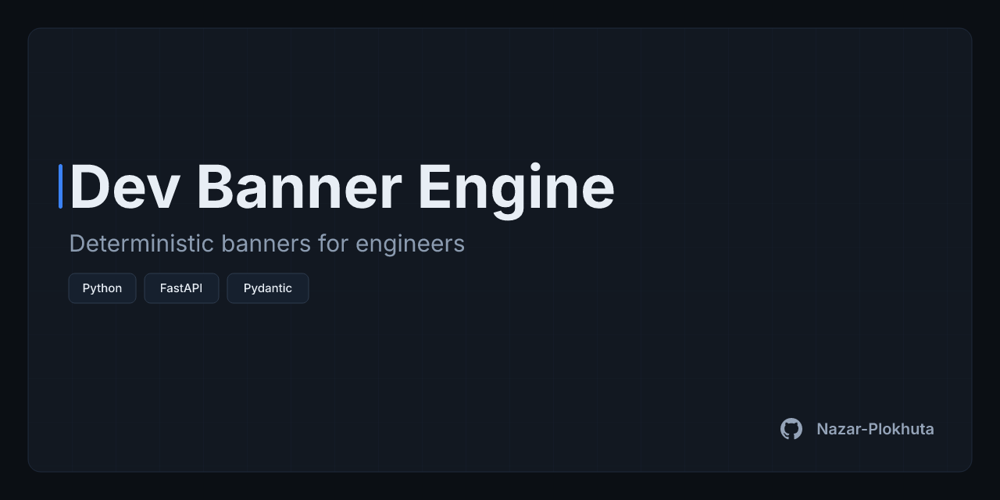

# dev-banner-engine

Deterministic SVG/XML banner generation engine with pixel-perfect PNG rasterization for GitHub repositories and Upwork portfolios.




## Core Architecture & Features

- **Deterministic layout computation.** Banners are assembled as pure XML strings from pixel-exact preset constants. There is no canvas, no layout engine and no I/O in the builder, so identical input always yields byte-identical SVG and zero canvas drift.
- **Headless rendering.** [`resvg-py`](https://pypi.org/project/resvg-py/) provides fast, Rust-based SVG-to-PNG rasterization with no browser dependency.
- **Injection-safe by construction.** All user-supplied text is escaped against XML entities (`&`, `<`, `>`, `"`, `'`) before it reaches the document.
- **Dual operation interfaces.** A fully featured Typer CLI for scripts and CI, and a FastAPI live-preview web server for interactive tuning.

### Calibrated Platform Presets

| Preset | Canvas | Ratio | Layout |
| --- | --- | --- | --- |
| `github-og` | 1280×640 | 2:1 | Asymmetric left-aligned layout with a vertical accent spine, tagline, tech chips and GitHub footer attribution. |
| `upwork-card` | 1200×900 | 4:3 | High-visibility centered thumbnail with a 136px title and massive 92px badges. No tagline or footer, so there is zero visual noise at the 240×180 portfolio card size. |

### Module Layout

| Path | Responsibility |
| --- | --- |
| `src/core/schema.py` | Immutable, strictly validated Pydantic v2 domain models. |
| `src/core/presets.py` | Canvas dimension registry, type scale and layout constants. |
| `src/core/svg_builder.py` | Deterministic SVG generation. |
| `src/raster/exporter.py` | Isolated SVG-to-PNG rasterization. |
| `src/cli.py` | Typer console interface. |
| `src/web/` | FastAPI live-preview service. |

## Installation & Quickstart

Requires Python 3.11+ and [uv](https://docs.astral.sh/uv/).

```bash
uv venv && uv pip install -e ".[dev]"
```

### CLI

Generate a single banner for one preset:

```bash
dev-banner generate \
  --title "Dev Banner Engine" \
  --tagline "Deterministic banners for engineers" \
  --chips "Python,FastAPI,Pydantic" \
  --preset github-og \
  --out assets \
  --filename hero-banner.png
```

Without `--filename`, the output is named `<title-slug>-<preset>.<format>`. Use `--format svg` to export the vector source instead of a PNG.

Export every preset in one run:

```bash
dev-banner generate \
  --title "Dev Banner Engine" \
  --tagline "Deterministic banners for engineers" \
  --chips "Python,FastAPI,Pydantic" \
  --all-presets
```

Batch mode renders every configuration from a JSON file containing one object or a list of objects:

```bash
dev-banner batch --config banners.json --out output
```

```json
[
  {
    "title": "Alpha",
    "tagline": "Event-driven ingestion",
    "chips": ["Python", "Kafka"],
    "preset": "github-og",
    "author": "Nazar-Plokhuta"
  }
]
```

Configurations that would write to the same output file are rejected before anything is rendered.

### Live Preview Web UI

```bash
dev-banner serve            # or: uv run dev-banner serve
dev-banner serve --host 127.0.0.1 --port 8000
```

Open <http://127.0.0.1:8000> to edit a banner and preview it live. The service also exposes `POST /api/render/svg` and `POST /api/render/png`.

## Design System Tokens

The palette is fixed: dark engineering, high-contrast B2B minimalism, with no gradients and a single accent element.

| Token | Value | Usage |
| --- | --- | --- |
| Canvas background | `#0B0F14` | Outer canvas |
| Card / surface | `#121821` | Banner card |
| Primary text | `#E8EEF5` | Title |
| Muted text | `#8B9BB0` | Tagline |
| Accent | `#3B82F6` | Vertical spine, `upwork-card` chip stroke |
| Hairline border | `#1E293B` | Card border, background grid (56px step, 0.20 opacity), `upwork-card` chip fill |
| Elevated chip surface | `#16202E` | `github-og` chip fill |
| Crisp chip border | `#2D3B4E` | `github-og` chip stroke |
| Footer text and icon | `#94A3B8` | Author attribution |
| Font stack | `Inter, -apple-system, BlinkMacSystemFont, "Segoe UI", Roboto, sans-serif` | All text, sans-serif only |

## Quality & Testing

- **Ruff** for formatting and linting: `ruff check . --fix && ruff format .`
- **Mypy** in strict mode across `src/` and `tests/`: `mypy src/ tests/`
- **Pytest** unit and snapshot tests covering the schema, presets, SVG builder, rasterizer, CLI and web service: `pytest tests/ -v`

## License

Released under the [MIT License](LICENSE).
